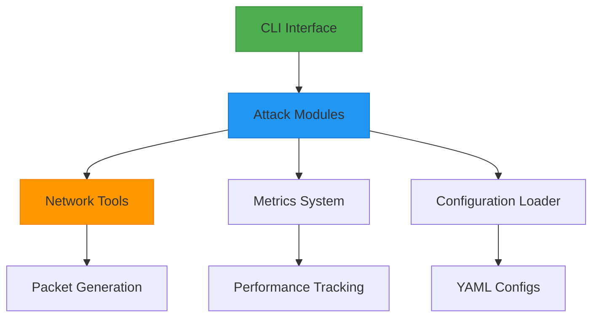
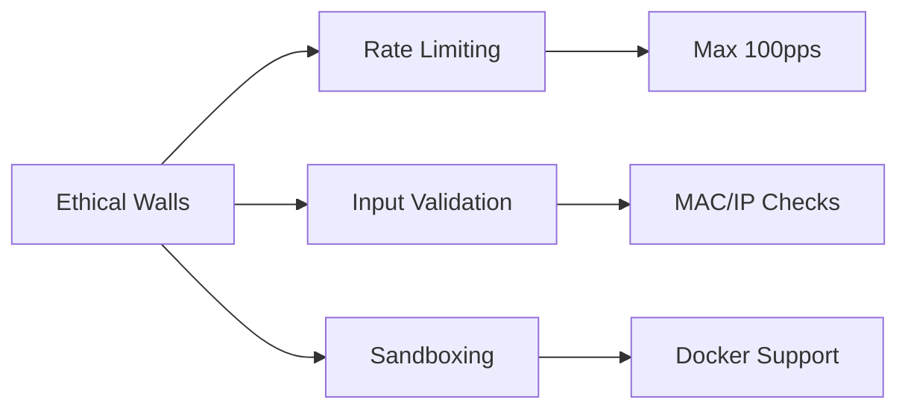

# Architecture Overview

## High-Level Design


## Core Components

### 1. Attack Modules
- **BaseAttack (Abstract Class)**
  - Thread management
  - Rate limiting
  - Safety controls
- **Concrete Implementations**
  - `DHCPExhaustion`
  - `ARPKeepAlive`
  - `TrafficLogger` (New)
    - Uses libpcap (`pcap_open_live`, `pcap_compile`, `pcap_dump_open`)
    - Supports BPF filters, duration and packet-count limits, snaplen, promiscuous mode
  - `ICMPFlooder` (Planned)

### 2. Network Utilities
- **Packet Crafting**
  - DHCP discovery builder
  - ARP announcement generator
- **Validation Tools**
  - MAC/IP validation
  - Port availability checks

### 3. Configuration System
```python
# Config Flow
CLI Arguments → YAML Config → Runtime Settings
```

### 4. Monitoring & Metrics
- Real-time statistics
- Packet success/failure rates
- Resource utilization tracking

## Data Flow
1. User invokes CLI command
2. Config loader merges settings
3. Attack module initializes
4. Network utils generate packets
5. Metrics system monitors traffic
6. Safety checks validate operations
7. Results logged/displayed

## Design Principles
1. **Modularity**: Plug-in attack modules
2. **Safety First**: Hardcoded rate limits
3. **Extensibility**: BaseAttack inheritance
4. **Observability**: Rich metrics & logging

## Security Considerations


## Future Directions
- **Planned Modules**
  - DNS Amplification
  - TCP SYN Flood
- **Architecture Improvements**
  - Async I/O implementation
  - Distributed attack nodes
  - Web UI dashboard
